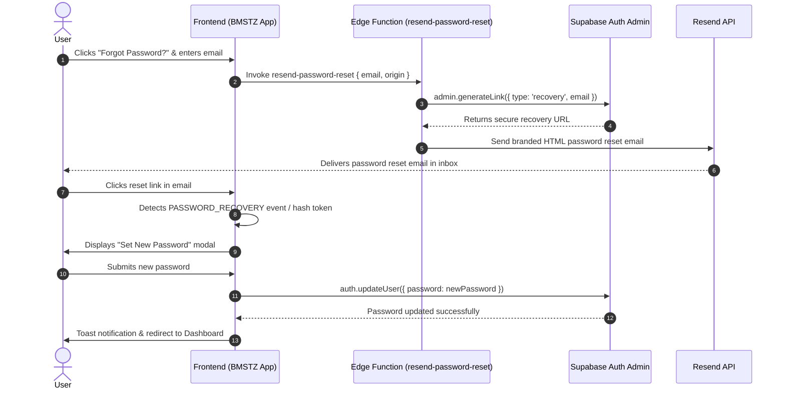

# Password Reset Configuration & Resend Integration Plan

Configure full password reset functionality for **BMSTZ** using **Resend API** for fast, reliable email delivery, and implement the complete end-to-end recovery flow (request reset → send branded email → handle recovery link → set new password).

---

## 🔍 Research & Findings

### Why Password Reset Emails Aren't Arriving Currently
1. **Reliance on Supabase Default Mailer**: `handlePasswordReset()` in `js/auth.js` currently calls `supabase.auth.resetPasswordForEmail(email)`. This relies on Supabase's default SMTP provider, which enforces strict rate-limiting, often delays emails, or silently drops delivery for unverified domains.
2. **Resend Edge Functions Disconnected**: While BMSTZ has Resend edge functions for welcome emails (`resend-welcome-email`), broadcasts (`resend-broadcast`), and support replies (`resend-support-reply`), there is no edge function configured for password reset emails.
3. **Missing Password Recovery Handling**: The application does not currently listen for Supabase `PASSWORD_RECOVERY` auth events or URL recovery tokens (`#type=recovery`), nor does it have a UI or API call to set a new password (`supabase.auth.updateUser({ password })`).

---

## 🛠️ Proposed Solution Architecture

---

## Proposed Changes

### Edge Functions

#### [NEW] [index.ts](file:///d:/v2%20BMS%20OFFICIAL/supabase/functions/resend-password-reset/index.ts)
- Create a new Supabase Edge Function `resend-password-reset`.
- Accepts `{ email, origin }` in request body.
- Uses `SUPABASE_SERVICE_ROLE_KEY` to generate an official recovery link using `supabaseAdmin.auth.admin.generateLink({ type: 'recovery', email, options: { redirectTo } })`.
- Formats a branded HTML email template matching BMSTZ design standards (dark/light clean aesthetic, security warnings, expiration info, reset button).
- Dispatches email directly via Resend API (`https://api.resend.com/emails`) using `RESEND_API_KEY`.

---

### Frontend Auth Module

#### [MODIFY] [auth.js](file:///d:/v2%20BMS%20OFFICIAL/js/auth.js)
- Update `handlePasswordReset()`:
  - Invokes `supabase.functions.invoke('resend-password-reset', { body: { email, origin } })`.
  - Fallback gracefully to `supabase.auth.resetPasswordForEmail(email)` if the edge function is unavailable.
- Add recovery token listener:
  - Listen to `supabase.auth.onAuthStateChange((event, session) => ...)` and check for `PASSWORD_RECOVERY` event or `#type=recovery` URL hash.
  - Automatically display the "Set New Password" modal when a recovery link is opened.
- Implement `handleUpdatePassword(newPassword)`:
  - Validates password strength (min 6 characters).
  - Calls `supabase.auth.updateUser({ password: newPassword })`.
  - Clears recovery URL hash, shows success toast, and logs user into dashboard cleanly.

#### [MODIFY] [main.js](file:///d:/v2%20BMS%20OFFICIAL/js/main.js)
- Register `handleUpdatePassword` and `initPasswordRecoveryListener` on `window` global scope.

---

### App UI & Modals

#### [MODIFY] [index.html](file:///d:/v2%20BMS%20OFFICIAL/app/index.html)
- Add a dedicated **Set New Password** form / modal container (`#setNewPasswordModal` or `#updatePasswordForm`) with password visibility toggle and confirmation field.

---

## 🧪 Verification Plan

### Automated / Manual Verification
1. **Reset Request Test**:
   - Navigate to `/app`, click "Forgot Password?".
   - Enter registered email and click "Send Reset Link".
   - Verify success toast appears and Resend API receives request.
2. **Email Delivery & Template Check**:
   - Check recipient inbox (or Resend dashboard logs) for the password reset email.
   - Ensure email contains valid recovery link, correct styling, and no broken URLs.
3. **Password Update Flow**:
   - Click recovery link in email.
   - Verify "Set New Password" modal opens automatically in BMSTZ app.
   - Enter new password and submit.
   - Verify password updates in Supabase Auth and user is redirected to dashboard.
4. **Login with New Password**:
   - Log out and log back in using the newly set password to confirm authentication works cleanly.
