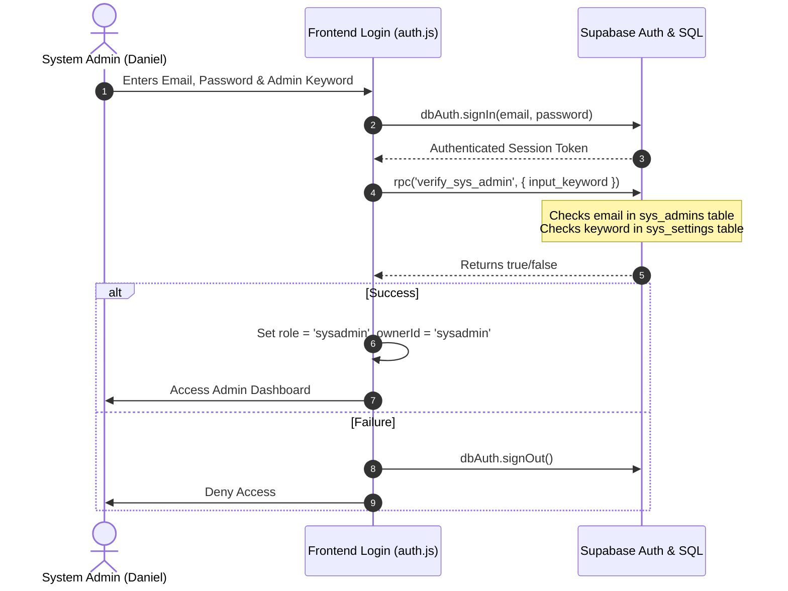

# System Administrator Security & Privilege Architecture

This document describes the security implementation, function execution model, table access policies, and operational workflows of the **System Administrator (SysAdmin)** in the BMSTZ platform. It also outlines how our proposed security and migration plan interacts with the SysAdmin role.

---

## 1. SysAdmin Identity & Authentication Flow

The System Administrator role is verified using a two-factor database-level check:



### Authentication Checks:
- **Email Verification (`public.is_sys_admin()`)**: Matches the authenticated user's email (`auth.jwt()->>'email'`) against the secure database table `public.sys_admins`.
- **Keyword Verification (`public.verify_sys_admin(input_keyword)`)**: Compares a client-supplied keyword against the secret setting `admin_keyword` stored in `public.sys_settings` in a transaction-secure manner.

---

## 2. Table Access & Permission Matrix

The System Admin operates with a platform-wide overview. Here is how their access is mapped across the different database categories:

| Table | Owner Policy | Manager Policy | SysAdmin Policy |
| :--- | :--- | :--- | :--- |
| **sys_settings / sys_banners** | Read Only | Read Only | **Full Read & Write Access** |
| **sys_newsletter_logs** | Blocked | Blocked | **Full Read & Write Access** |
| **sys_security_events** | Blocked | Blocked | **Full Read & Write Access** (Audit log visibility) |
| **profiles** | Own profile only | Blocked | **Select All** (View tenant details) |
| **branches** | Own branches only | Managed branch only | **Select All** (Platform branch audit) |
| **sales / inventory** | Own branches only | Managed branch only | **Select All** (Verify catalog and transactions) |
| **stock_movements** | Own branches only | Managed branch only | **Select All** (Verify movement logs) |
| **central_inventory** | Own tenant only | Own tenant only | **Select All** |

---

## 3. Administrative Function Inventory

The database contains several RPC APIs that can **only** be executed by verified SysAdmins. If a non-admin tries to run them, the functions raise a strict `'Access denied: System Administrator only'` exception:

1. **Tenant Health & Resource Monitor (`get_tenant_health_metrics()`)**:
   - Returns storage space, branch count, sales volume, inventory items, and audit log entries per business owner to analyze usage.
2. **Emergency Lockout System (`emergency_lockout_account(target_id, target_type)`)**:
   - Instantly locks out a compromised Owner (BSO) or Manager (BR) account by updating their status to `'locked'` in the database, automatically locking out all downstream branch activities.
3. **Unlock Account (`unlock_account(target_id, target_type)`)**:
   - Reverts emergency lockouts, restoring active status to profiles and branches.
4. **Platform Billing Analytics (`get_platform_revenue_analytics()`)**:
   - Compiles monthly recurring revenue (MRR), plan distribution counts, and billing statuses.
5. **Feature Flag Manager (`toggle_sys_feature_flag(p_key, p_enabled)`)**:
   - Controls experimental features or deploys hotfixes dynamically.
6. **Compliance Vault exporter (`export_tenant_compliance_data(target_owner_id)`)**:
   - Packages and exports all business operations (sales, movements, logs) for a tenant into a single compliance JSON payload.

---

## 4. How the Security Plan Empowers & Protects the SysAdmin

Our proposed server-side migration plan specifically accommodates the SysAdmin role in three distinct ways:

### ⚡ Empowerment: Exemption from Client DML Constraints
In the quantity-protection triggers (`check_inventory_mutations`, `check_central_inventory_direct_mutation`), we check:
```sql
IF ... AND current_user = session_user AND NOT public.is_sys_admin() THEN
    RAISE EXCEPTION ...
END IF;
```
- **What this means**: If a business owner contacts support regarding a corrupted catalog item or incorrect inventory levels due to physical stock damage, the **SysAdmin can directly update inventory quantity fields** in the database, bypassing the RPC rules. 
- Direct mutations are blocked only for ordinary clients (`session_user = current_user`).

### 🛡️ Guardrails: Tenant Neutrality (`get_current_tenant_id()`)
In `get_current_tenant_id()`, we prepend:
```sql
IF public.is_sys_admin() THEN RETURN NULL; END IF;
```
- **What this means**: This prevents the SysAdmin from accidentally being associated with a single branch or tenant. Since `NULL` is returned, any transaction or configuration insert executed by the SysAdmin must explicitly define the target tenant ID, preventing silent data pollution.

### 🛡️ Entitlements Override
In `check_profile_mutations()`, we enforce:
```sql
IF auth.uid() <> NEW.id AND NOT public.is_sys_admin() THEN
    RAISE EXCEPTION 'Unauthorized: You cannot modify another profile.';
END IF;
```
- **What this means**: While ordinary tenants cannot modify their billing columns (such as changing their plan from Starter to Exclusive), the **SysAdmin is exempted and can directly escalate or modify billing states** on the profiles table (e.g. manually extending a trial or upgrading an account during manual payments).
