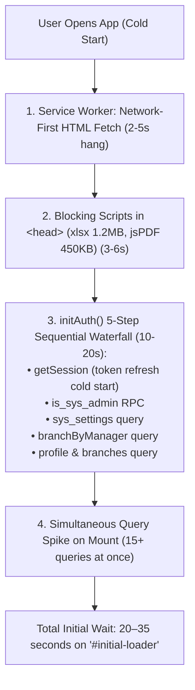

# Fast Initial App Load & Instant Session Restoration Architecture

## Overview
When opening the application after a period of inactivity (hours or days), users currently experience initial loading delays of up to 30 seconds with a persistent full-screen spinner ("Initializing BMS...").

This plan addresses all root causes of this latency through a multi-tier optimization strategy:
1. **Instant Optimistic Boot (Stale-While-Revalidate UI)**: Hydrate dashboard state and dismiss `#initial-loader` in < 100ms using cached verified session data, validating session in the background.
2. **Elimination of the 5-Step Sequential Network Waterfall**: Replace 5 sequential network round-trips with a single parallel batch (`Promise.all`) protected by a 5-second fail-safe timeout.
3. **Service Worker Navigation Acceleration**: Replace the network-first blocking strategy in `sw.js` with instant Cache-First / Stale-While-Revalidate for app navigation, delivering `/app/index.html` in ~20ms.
4. **CDN Script Deferral & Pre-warming**: Remove 1.7 MB of non-critical PDF/Excel scripts (`xlsx.min.js`, `jspdf.min.js`) from blocking `<head>`, load them dynamically on-demand, and add DNS preconnects for Supabase.
5. **Boot Query De-duplication & Staggering**: Re-use `state.branches` in `renderOwnerOverview()` and stagger background notification/banner checks to eliminate connection pool contention on cold starts.

---

## Detailed Root Cause Analysis



---

## Proposed Changes

Grouped by component layer:

### 1. Service Worker & PWA Layer

#### [MODIFY] [vite.config.js](file:///d:/v2%20BMS%20OFFICIAL/vite.config.js)
- Update `serviceWorkerBumpPlugin` in `vite.config.js` to generate `public/sw.js` with **Stale-While-Revalidate / Cache-First Navigation**:
  - Return cached `/app/index.html` immediately from CacheStorage (< 20ms) for navigation requests.
  - Concurrently fetch the latest `/app/index.html` in the background and update the cache.

#### [MODIFY] [public/sw.js](file:///d:/v2%20BMS%20OFFICIAL/public/sw.js)
- Synchronize `public/sw.js` with the fast navigation caching strategy.

---

### 2. Application Entry & CDN Script Optimization

#### [MODIFY] [app/index.html](file:///d:/v2%20BMS%20OFFICIAL/app/index.html)
- Add Supabase connection preconnects in `<head>`:
  ```html
  <link rel="preconnect" href="https://ojnxraxdynbhddfviweb.supabase.co" crossorigin>
  <link rel="dns-prefetch" href="https://ojnxraxdynbhddfviweb.supabase.co">
  ```
- Remove blocking `<script>` tags for `jspdf.umd.min.js`, `jspdf.plugin.autotable.min.js`, and `xlsx.full.min.js` from `<head>`.
- Add lazy dynamic script loader utility for PDF and Excel export triggers in `report_pdf_engine.js` / report modules.

---

### 3. Authentication & Instant Session Hydration

#### [MODIFY] [js/auth.js](file:///d:/v2%20BMS%20OFFICIAL/js/auth.js)
- **Instant Optimistic Boot**:
  - On startup, immediately inspect `localStorage` for `bms_session_${role}_${userId}` or `bms_last_active_role` / `bms_last_active_user`.
  - If valid cached credentials exist:
    1. Immediately hydrate `state.role`, `state.ownerId`, `state.profile`, `state.branches`, `state.branchProfile`.
    2. Set UI to dashboard view and call `hideInitialLoader()` immediately (< 50ms).
- **Consolidated Parallel Background Revalidation**:
  - Run `dbAuth.getSession()`, `supabase.rpc('is_sys_admin')`, `sys_settings`, and profile/branch queries **in parallel with `Promise.allSettled`**.
  - Wrap with a 5-second timeout (`Promise.race`) so slow network connections or Supabase compute wakeups never freeze the user.
  - If revalidation succeeds: update state seamlessly with fresh data.
  - If user is expired or signed out: gracefully redirect to login.

---

### 4. Overview & Boot Query De-duplication

#### [MODIFY] [js/owner/overview.js](file:///d:/v2%20BMS%20OFFICIAL/js/owner/overview.js)
- Re-use `state.branches` if already available in memory instead of immediately making a redundant `dbBranches.fetchAll()` call on mount.
- Load overview data asynchronously while KPI skeletons render smoothly.

#### [MODIFY] [js/app.js](file:///d:/v2%20BMS%20OFFICIAL/js/app.js)
- Stagger initial `checkNotifications(true)` and `showActiveSystemBanners()` with `setTimeout(..., 400)` so they run after the primary dashboard view has completed its first paint.

---

## Verification Plan

### Automated Verification
- Run `npm run build` to verify all 150+ modules compile with 0 errors.

### Manual Verification
1. **Cold Start Simulation**: Close browser tab, simulate 2-hour elapsed session or throttled 3G network in DevTools, and open `/app/`.
2. **Timing Benchmark**: Verify that `#initial-loader` disappears in < 150ms and the dashboard shell appears immediately.
3. **Background Sync Check**: Verify that data (sales, notifications, banners) populates cleanly without screen flicker.
4. **Report Export Validation**: Click "Download PDF" and "Export CSV" in Reports Hub to verify dynamic on-demand loading of jsPDF and XLSX libraries works seamlessly.
