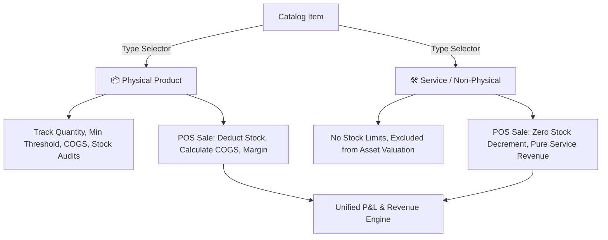

# Comprehensive Analysis & Implementation Plan: Hybrid Products & Services Business Model

## 1. Executive Summary & Problem Analysis

In standard retail/wholesale POS systems, every catalog item is treated as physical inventory with a stock quantity, cost of goods sold (COGS), stock deduction logic, and reorder alerts. 

However, modern small and medium enterprises (SMEs) frequently operate on **Hybrid Business Models**:
- **Stationery & Cyber Cafés**: Sell physical stationery (pens, notebooks, reams) alongside services (online government registrations, TIN registration, document audits, printing/laminating).
- **Auto Garages & Spare Parts**: Sell physical parts (brake pads, spark plugs) alongside labor/services (oil change, wheel alignment, diagnosis).
- **Salons & Cosmetics**: Sell beauty products (shampoos, creams) alongside styling and treatment services.
- **Electronics & Computer Shops**: Sell devices and accessories alongside repair, software installation, and network setup services.

### Core Differences Between Products and Services:
| Dimension | Physical Product (📦) | Service Offering (🛠️) |
| :--- | :--- | :--- |
| **Inventory Tracking** | Decrements shelf quantity on every sale. Blocks sale if out of stock. | Unlimited availability / Non-depleting. Never blocks sales due to stock count. |
| **Stock Valuations** | Included in Balance Sheet & Asset Valuation (`quantity × cost_price`). | Excluded from Asset/Stock Valuation (does not occupy shelf inventory capital). |
| **Cost of Goods (COGS)** | Direct supplier purchase cost. | Direct COGS is 0 (or third-party disbursement fee like government portal fees). |
| **Restock Velocity & Audits** | Tracked in Stock Take Audits, Restock Velocity, and Reorder alerts. | Excluded from physical stock counts and physical dispatch audits. |
| **POS Checkout Experience** | Barcode scanning, quantity on shelf, retail/wholesale tier pricing. | Quick search, fixed service fee or variable project pricing, service staff assignment. |

---

## 2. Architectural Blueprint

---

## 3. Database & Schema Design

### 3.1 Migration: `sql/0004_hybrid_products_and_services_model.sql`
1. **`public.inventory` & `public.central_inventory`**:
   - Add column `item_type TEXT NOT NULL DEFAULT 'product' CHECK (item_type IN ('product', 'service'))`
   - Add column `service_category TEXT DEFAULT NULL` (e.g. 'Government Registrations', 'Printing & Typing', 'Repairs & Maintenance', 'Consultation')
   - Add column `is_variable_pricing BOOLEAN DEFAULT false` (allows custom price at POS checkout for tailored services)

2. **Trigger Logic Update (`fn_deduct_inventory_on_sale`)**:
   - Guard stock deduction: ONLY decrement `quantity` when `item_type = 'product'` (or when `product_id` corresponds to a product).
   - If `item_type = 'service'`, bypass inventory depletion and zero-stock validation triggers.

3. **`public.sales` & Line Items**:
   - Include `item_type` in sales JSON line items (`items` JSONB).
   - Gross profit for services calculated as `amount - COALESCE(cost_amount, 0)`.

---

## 4. Frontend & User Interface Architecture

### 4.1 Catalog Management (Central & Branch Inventory)
- **Item Type Switcher**:
  - A toggle on the "Add Item" / "Edit Item" modal: `📦 Physical Product` vs `🛠️ Service / Offering`.
- **Dynamic Field Visibility**:
  - When **Product** is selected: Show `Quantity`, `Min Stock Alert`, `Cost Price`, `Retail Price`, `Wholesale Price`, `SKU/Barcode`.
  - When **Service** is selected: Hide `Quantity` and `Min Alert`. Show `Service Name`, `Service Category`, `Standard Service Fee`, optional `Direct Expense / Third-Party Cost`, and `Allow Custom Amount at Checkout`.
- **Category & Filter Pills**:
  - Filter tabs in Inventory view: `[ All (120) ]` `[ 📦 Products (85) ]` `[ 🛠️ Services (35) ]`.

### 4.2 Point of Sale (POS) Checkout
- **Instant Service Ring-Up**:
  - Services display distinct visual badge (e.g., violet/cyan wrench icon or `🛠️ SERVICE` chip).
  - Clicking a service immediately adds it to the cart with no "Out of stock" warning.
  - Cart line items clearly distinguish between products and services.
- **Printed Receipts, Invoices & Quotations**:
  - Invoices and receipts categorize line items or render cleanly with itemized description (e.g., "1x Online Certificate Registration").

### 4.3 Financial Reports, P&L & Analytics
- **Revenue Stream Breakdown**:
  - Breakdown KPI cards: **Product Sales Revenue** vs **Service Income**.
- **Inventory Capital & Valuation**:
  - Total Asset / Inventory Capital strictly counts physical goods (`item_type = 'product'`), ensuring accurate net book value without artificial inflation.

---

## 5. Phased Implementation Roadmap

1. **Phase 1: Database & RPC Infrastructure**
   - Create migration `sql/0004_hybrid_products_and_services_model.sql`.
   - Update stock deduction triggers and sale validation RPCs.
2. **Phase 2: Inventory & Catalog UI**
   - Update `js/owner/inventory.js`, `js/owner/central_inventory.js`, and `js/branch/inventory.js`.
   - Add Product/Service toggle and adaptive form fields.
3. **Phase 3: POS & Sales Checkout**
   - Update `js/branch/sales.js` and cart engine to support zero-stock service items.
4. **Phase 4: Quotations, Invoices & Receipts**
   - Update document generators in `js/owner/invoices.js` and `js/owner/quotations.js`.
5. **Phase 5: Financial Reporting & Analytics**
   - Update `js/owner/overview.js`, `js/owner/financial_reports.js`, and `js/owner/analytics.js` for separate Product vs Service revenue breakdowns.
