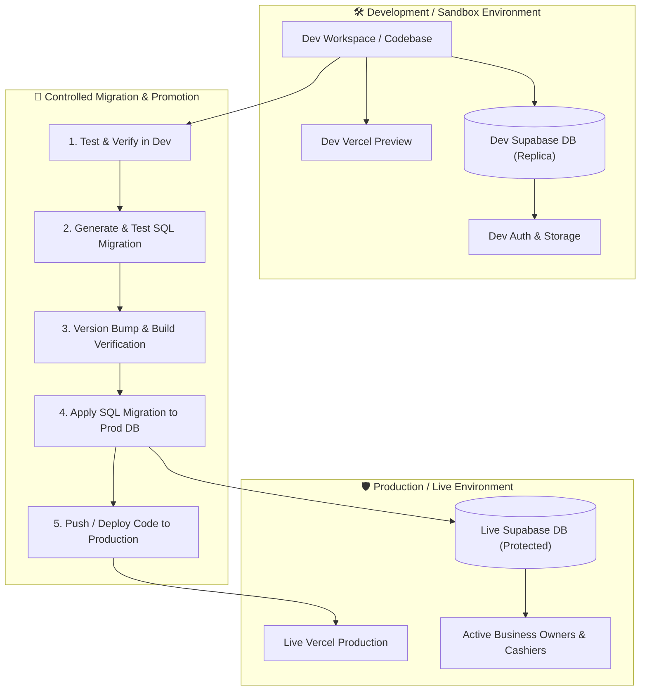

# Implementation Plan: Staging/Development to Production Dual-Environment Workflow

A comprehensive architecture, release management protocol, and database migration system for safely building and testing features in a replica Development environment before promoting them to the Live Production environment.

---

## 1. Executive Summary & Objective

The goal is to maintain two isolated, identical environment stacks:
1. **Development / Staging Environment (Sandbox)**:
   - Dedicated Supabase Project (Dev Database, Auth, Storage, Edge Functions).
   - Dedicated GitHub Repository / Branch (`develop`).
   - Dedicated Vercel Staging Deployment URL.
   - Purpose: Feature development, database schema alterations, UI experiments, stress-testing, and debugging with zero risk to live business operations.
2. **Production Environment (Live)**:
   - Dedicated Supabase Project (Live Database, active paying businesses, real financial ledgers).
   - Dedicated GitHub Repository / Branch (`main`).
   - Dedicated Production Vercel Deployment (`app.bmstz.com` / production domain).
   - Purpose: High availability, zero downtime, protected live data, and stable customer usage.

---

## 2. Dual-Environment Architecture Overview



---

## 3. Database Schema & Migration Management

### 3.1 Migration Rules for Safe Production Rollouts
To ensure that production migrations never break existing user data, all database changes created during development MUST follow the **Forward-Compatible Zero-Downtime Pattern**:

1. **Table Creation**: Always use `CREATE TABLE IF NOT EXISTS public.<table_name> (...)`.
2. **Column Additions**: Always use `ALTER TABLE public.<table_name> ADD COLUMN IF NOT EXISTS <column_name> <type> [DEFAULT <value>];`.
3. **Constraint Changes**: If adding a new column that will eventually be required, always add it as nullable or with a `DEFAULT` value so existing production rows do not violate `NOT NULL`.
4. **Functions & RPCs**: Always use `CREATE OR REPLACE FUNCTION public.<func_name>()`. If altering parameter names or return types, include a safe drop guard:
   ```sql
   DO $$ BEGIN DROP FUNCTION IF EXISTS public.<func_name>(<types>); EXCEPTION WHEN OTHERS THEN NULL; END $$;
   CREATE OR REPLACE FUNCTION public.<func_name>(...) ...
   ```
5. **RLS Policies**: Always drop existing policy before recreating to ensure clean updates:
   ```sql
   DROP POLICY IF EXISTS "<policy_name>" ON public.<table_name>;
   CREATE POLICY "<policy_name>" ON public.<table_name> ...;
   ```
6. **Trigger Updates**: Drop trigger before recreating to avoid duplicate trigger attachment:
   ```sql
   DROP TRIGGER IF EXISTS <trigger_name> ON public.<table_name>;
   CREATE TRIGGER <trigger_name> ...;
   ```

### 3.2 SQL Migration Numbering Convention
Every database change created in Development must be saved sequentially in the `sql/` directory as:
```text
sql/
├── 0001_master_full_restore.sql
├── 0002_add_custom_invoice_templates.sql
├── 0003_upgrade_stock_transfer_rpcs.sql
└── 0004_consolidated_migration_v3_6_0.sql
```
*Rule: When multiple SQL migrations are created during a feature iteration, also provide a consolidated single-run migration script for fast execution.*

---

## 4. Environment Secrets & Configuration Isolation

Ensure that client-side and server-side configurations are strictly separated by environment variables:

| Configuration Parameter | Development Environment | Production Environment |
|---|---|---|
| `VITE_SUPABASE_URL` | Dev Supabase Project URL | Prod Supabase Project URL |
| `VITE_SUPABASE_ANON_KEY` | Dev Supabase Anon Key | Prod Supabase Anon Key |
| `SUPABASE_SERVICE_ROLE_KEY` | Dev Service Role Key (Vercel Serverless) | Prod Service Role Key (Vercel Serverless) |
| `VAPID_PUBLIC_KEY` | Dev Web Push Public Key | Prod Web Push Public Key |
| `VAPID_PRIVATE_KEY` | Dev Web Push Private Key | Prod Web Push Private Key |
| `APP_ENV` | `development` / `staging` | `production` |

> [!IMPORTANT]
> **No Environment Cross-Contamination**:
> - Never use Production Supabase API keys in the Development codebase or `.env`.
> - Never hardcode Supabase URLs or tokens inside JS files; always resolve dynamically via environment variables or central config modules.

---

## 5. Step-by-Step Promotion Workflow (Dev to Prod)

When a new feature, UI overhaul, or fix is ready to be released:

### Step 1: Verification in Development
1. Build and test the feature in the Development workspace.
2. Verify all database reads, writes, RPCs, and RLS policies on the Development Supabase instance.
3. Run automated lint check and production compilation:
   ```bash
   npm run build
   ```

### Step 2: Prepare Database Migration
1. Collect all table DDL, functions, RLS policies, or index changes made during development into a timestamped migration file (e.g. `sql/0002_feature_name.sql`).
2. Verify that the SQL script executes cleanly on the Development database.

### Step 3: Apply Migration to Production Database
1. Open the **Production Supabase SQL Editor**.
2. Run the migration script (`sql/0002_feature_name.sql`).
3. Verify that the schema updates completed with zero errors.

### Step 4: Version Bump & Release Notes Sync
1. Increment the application version in [`release_notes.json`](file:///d:/v2%20BMS%20OFFICIAL/release_notes.json) (e.g., `3.5.9` -> `3.6.0`).
2. Add short, customer-friendly release notes under `"owner"` and `"branch"` (no technical backend jargon).
3. Synchronize `APP_VERSION` in [`js/updateChecker.js`](file:///d:/v2%20BMS%20OFFICIAL/js/updateChecker.js).
4. Run `npm run build` to compile the updated service worker and distribution bundles.

### Step 5: Promote Code to Production Workspace
1. Copy/merge the validated files from the Development workspace into the Production workspace (or git merge from `develop` into `main`).
2. Deploy to Production Vercel.
3. Perform a quick sanity check on the live URL.

---

## 6. Workspace Protocol & Safety Rules

- **Code Guard**: Protected sections and completed architectures are preserved using `Chat_History/chat_history.txt` as the historical record.
- **Audit Logging**: Every migration, schema edit, and release step is recorded in `Chat_History/chat_history.txt` with exact file paths and line numbers.
- **Deployment Control**: Deployment commands (`vercel --prod`) and git commits are never executed automatically; they are executed only upon explicit user command.
