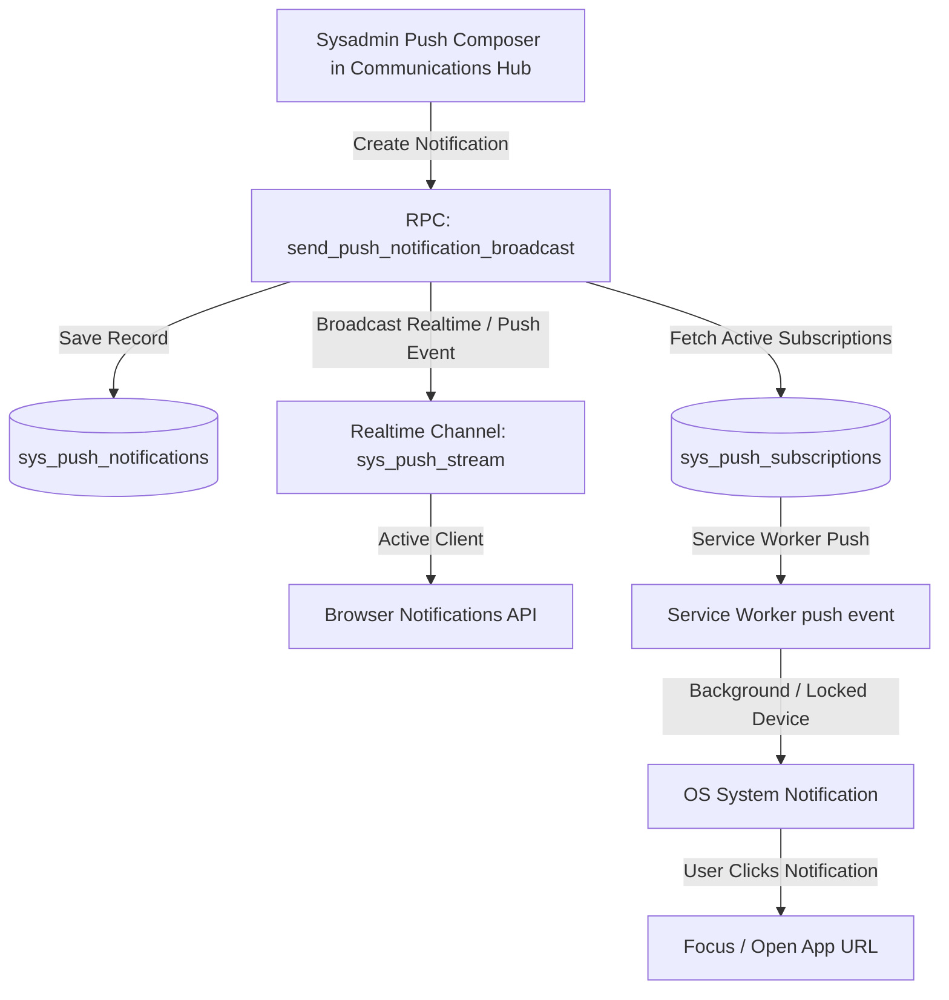

# Implementation Plan: System Admin Push Notifications & Broadcast Interface (Plan 16)

Empower System Administrators to compose and broadcast Web Push Notifications to all platform users, specific business owners, or branch managers with live preview, device subscription tracking, and Service Worker push listeners.

---

## 1. Architectural Overview & Components

---

## 2. Proposed Changes

### Database Layer (`supabase/`)
#### [NEW] `supabase/0001_create_push_notifications_and_subscriptions.sql`
- Create `public.sys_push_subscriptions` table:
  - `id UUID PRIMARY KEY DEFAULT gen_random_uuid()`
  - `user_id UUID NOT NULL`
  - `role TEXT NOT NULL` (`sysadmin`, `owner`, `branch`)
  - `endpoint TEXT NOT NULL UNIQUE`
  - `p256dh TEXT NOT NULL`
  - `auth TEXT NOT NULL`
  - `user_agent TEXT`
  - `created_at TIMESTAMPTZ DEFAULT NOW()`
  - `updated_at TIMESTAMPTZ DEFAULT NOW()`
- Create `public.sys_push_notifications` table:
  - `id UUID PRIMARY KEY DEFAULT gen_random_uuid()`
  - `title TEXT NOT NULL`
  - `body TEXT NOT NULL`
  - `icon TEXT DEFAULT '/bmtzofficiallogo.png'`
  - `badge TEXT DEFAULT '/bmtzofficiallogo.png'`
  - `image_url TEXT`
  - `url TEXT DEFAULT '/app/'`
  - `target_audience TEXT DEFAULT 'all'` (`all`, `owners`, `managers`, `specific`)
  - `target_role TEXT`
  - `sent_count INTEGER DEFAULT 0`
  - `status TEXT DEFAULT 'sent'`
  - `created_by UUID`
  - `created_at TIMESTAMPTZ DEFAULT NOW()`
- Add Row Level Security (RLS) policies:
  - Authenticated users can insert/update/delete their own push subscriptions.
  - Sysadmins can read all subscriptions and dispatch push notifications.
- Create `public.send_push_notification_broadcast(...)` stored procedure.

---

### Service Worker Layer (`public/sw.js` & `vite.config.js`)
#### [MODIFY] `vite.config.js` & `public/sw.js`
- Add `self.addEventListener('push', (event) => { ... })`:
  - Parses incoming push payload or falls back to server-notified message.
  - Shows OS-level system notification via `self.registration.showNotification(title, options)`.
- Add `self.addEventListener('notificationclick', (event) => { ... })`:
  - Closes notification and focuses existing window or opens the designated URL.

---

### Client Push Subscription Engine (`js/`)
#### [NEW] `js/pushNotifications.js`
- `requestPushPermission()`: Requests permission and prompts the user cleanly.
- `subscribeToPushNotifications()`: Registers push subscription via `serviceWorkerRegistration.pushManager` and saves credentials to `sys_push_subscriptions`.
- `unsubscribeFromPush()`: Unregisters endpoint and removes from database.
- `initPushRealtimeListener()`: Subscribes to realtime push events to display notifications while the tab is foregrounded.

---

### System Admin Communications Hub (`js/admin/communications.js`)
#### [MODIFY] `js/admin/communications.js`
- Add **Push Notifications** tab to `renderAdminCommunications()`:
  - **Metric Scorecards**: Total Registered Devices, Business Owners Subscribed, Branch Managers Subscribed, Total Push Broadcasts Sent.
  - **Interactive Push Composer**:
    - Notification Title & Message inputs with character counters.
    - Target Audience Selector (`All Platform Devices`, `Business Owners Only`, `Branch Managers Only`).
    - Custom Target URL (e.g. `/app/#view=overview`, `/app/#view=sales`).
    - Optional Image / Banner URL.
    - **Live Device Preview**: Visual mobile lock-screen & desktop notification mockup with instant preview of title, body, icon, and timestamp.
    - **"Send Push Notification"** Action Button (with step-up confirmation modal).
    - **"Send Test to My Device"** Button to immediately test delivery on the admin's active device.
  - **Push Notification History Ledger**:
    - Data table showing past broadcasts, delivery counts, target audiences, and timestamps.

---

## 3. Verification Plan

### Automated Tests & Builds
- Run `npm run build` to verify 0 build, module, or syntax errors.

### Manual Verification
- Log in as `System Admin` and navigate to **Communications Hub** -> **Push Notifications**.
- Verify the subscriber counts, interactive push composer, and live mobile/desktop preview card.
- Test sending a test push notification and verify the browser prompt and notification delivery.
